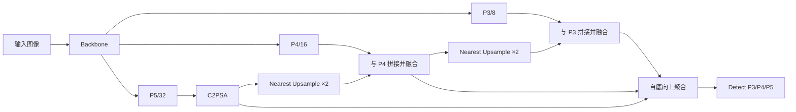
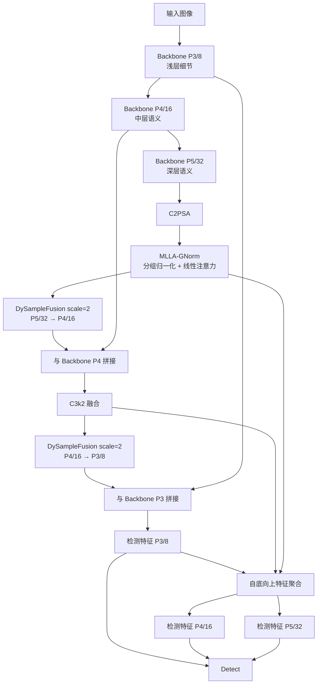
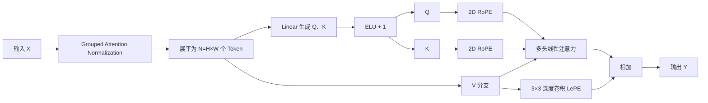
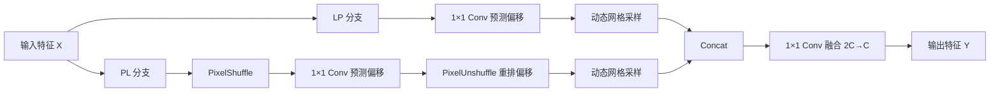

# 改良 YOLO26 相比原始 YOLO26 的结构、优势及问题解决机制

## 摘要

原始 YOLO26n 具有结构紧凑、计算量较低和端到端检测等优点，但其深层 P5 特征经过 `C2PSA` 后直接进入颈部网络，缺少针对注意力输入分布的进一步稳定化处理；同时，颈部采用固定最近邻插值完成 P5→P4 和 P4→P3 的上采样，采样位置不随图像内容变化，在复杂背景、目标边界模糊或尺度变化明显时，可能出现深层语义利用不足、上采样细节丢失以及跨尺度特征空间对齐不充分等问题。

针对上述问题，本文对 YOLO26n 进行了两项改良：首先，在 Backbone 的 P5/32 输出端加入带分组归一化的线性注意力模块 MLLA-GNorm，用于稳定通道特征分布并进一步建立全局空间关系；其次，以 DySampleFusion 替换 Neck 中的两次固定最近邻上采样，使模型能够根据输入内容学习采样偏移，并融合 LP 与 PL 两种动态上采样结果。改良模型形成了“深层语义细化—内容感知上采样—多尺度特征融合”的连续处理链路。

在当前数据集和训练设置下，改良 YOLO26n 的 mAP50 由 87.679% 提升至 88.069%，mAP50-95 由 60.120% 提升至 61.121%，分别提高 0.390 和 1.001 个百分点。更显著的 mAP50-95 增幅表明，改良结构的主要优势体现在多 IoU 阈值下的综合检测质量和更严格定位条件下的表现。

> 说明：`model2025` 目录中的两个 Python 文件是模块设计原型；实际训练调用的是 `ultralytics/nn/extra_modules` 目录下的工程实现。本文的结构、张量布局与数学过程以实际训练代码为准。

## 1. 原始 YOLO26 的结构与待解决问题

### 1.1 原始结构

原始 YOLO26n 使用 Backbone 提取 P3、P4、P5 三个尺度的特征，并通过自顶向下和自底向上的 Neck 完成多尺度融合，最后将 P3/8、P4/16、P5/32 输入检测头：



原始 Neck 的两次上采样均为：

```yaml
- [-1, 1, nn.Upsample, [None, 2, "nearest"]]
```

### 1.2 问题一：深层语义特征仍可进一步细化

P5/32 特征经过多次下采样，空间尺寸较小但语义信息最强。原始 YOLO26 已使用 `C2PSA` 进行特征增强，因此不能简单认为其“不具备注意力能力”；更准确的问题是：`C2PSA` 输出会直接进入 Neck，缺少一个显式的分组归一化与线性全局关系细化阶段。

在通道响应差异较大、背景干扰强或目标区域相距较远时，仍可能存在以下不足：

- 少数高响应通道对后续注意力或特征融合产生较强影响。
- P5 特征中的远距离空间依赖仍有进一步建模空间。
- 全局语义、二维位置关系与局部纹理之间需要更明确的联合约束。

### 1.3 问题二：固定最近邻上采样不具备内容感知能力

设输入低分辨率特征为 $X$，放大倍数为 $s=2$。最近邻插值的输出可以写为：

$$
Y(c,i,j)=X\left(c,\left\lfloor\frac{i}{s}\right\rfloor,
\left\lfloor\frac{j}{s}\right\rfloor\right).
$$

该操作只是将同一位置的特征值复制到相邻网格，不学习采样偏移，也不判断当前位置属于目标内部、目标边缘还是背景。因此可能产生以下问题：

- 目标边界附近的特征被机械复制，空间变化不够平滑。
- 高层特征与 P4、P3 浅层特征拼接时可能出现位置对应不准确。
- 小目标或细长目标的局部细节可能在多次尺度变换中进一步减弱。
- 对所有图像和空间位置采用同一采样规则，无法适应目标形状与尺度变化。

### 1.4 问题三：语义增强和尺度传递彼此割裂

仅增强 P5 特征并不能保证高级语义被准确传递到高分辨率层；仅改进上采样也不能保证其输入包含充分、稳定的上下文信息。原始结构中的深层特征建模和上采样操作相对独立，因此本次改良同时处理“传递什么特征”和“如何传递特征”两个问题。

## 2. 改良 YOLO26 的总体结构

改良网络保留原始 YOLO26 的 Backbone 主体、PAN 式双向特征融合和三尺度 Detect 头，只对两个关键位置进行增强：

1. 在 P5/32 的 `C2PSA` 后加入一个 MLLA-GNorm。
2. 将 Neck 中的两次 `nn.Upsample` 替换为 DySampleFusion。



对应配置如下：

```yaml
- [-1, 2, C2PSA, [1024]]
- [-1, 1, MLLAttentionWithGroupedNorm, []]  # P5/32

head:
  - [-1, 1, DySampleFusion, []]              # P5/32 → P4/16
  - [[-1, 6], 1, Concat, [1]]
  - [-1, 2, C3k2, [512, True]]

  - [-1, 1, DySampleFusion, []]              # P4/16 → P3/8
  - [[-1, 4], 1, Concat, [1]]
  - [-1, 2, C3k2, [256, True]]
```

原始与改良结构的关键区别为：

| 对比位置 | 原始 YOLO26n | 改良 YOLO26n | 预期作用 |
|---|---|---|---|
| P5/32 输出端 | `C2PSA` 后直接进入 Neck | `C2PSA` 后加入 MLLA-GNorm | 稳定深层特征并补充全局关系建模 |
| P5→P4 上采样 | 固定最近邻插值 | DySampleFusion | 改善高级语义向 P4 的自适应传递 |
| P4→P3 上采样 | 固定最近邻插值 | DySampleFusion | 保留高分辨率细节并改善小目标表征 |
| 检测输出 | P3、P4、P5 | P3、P4、P5 | 保持原三尺度检测接口不变 |

## 3. MLLA-GNorm：解决深层特征分布与全局关系问题

### 3.1 输入输出结构

MLLA-GNorm 位于 Backbone 的 P5/32 末端。对于输入特征：

$$
X\in\mathbb{R}^{B\times C\times H\times W},
$$

模块保持空间尺寸和通道数不变：

$$
\operatorname{MLLA\text{-}GNorm}(X)
\in\mathbb{R}^{B\times C\times H\times W}.
$$

其内部结构为：



### 3.2 分组归一化

将 $C$ 个通道划分为 $G$ 组，每组包含 $C/G$ 个通道。对每个样本、每个空间位置和每个通道组分别计算：

$$
\mu_g=\frac{1}{C/G}\sum_{k=1}^{C/G}X_{g,k},
$$

$$
\sigma_g^2=\frac{1}{C/G}\sum_{k=1}^{C/G}
\left(X_{g,k}-\mu_g\right)^2,
$$

$$
\hat{X}_{g,k}=
\frac{X_{g,k}-\mu_g}{\sqrt{\sigma_g^2+\varepsilon}}.
$$

工程实现默认最多使用 8 组，并通过 $\gcd(C,8)$ 保证组数能够整除通道数。该归一化不依赖整个批次的统计量，因此更适合检测任务中常见的小 Batch Size；同时，不同通道组独立归一化可降低极端通道响应对其余通道的干扰。

### 3.3 查询、键与值

将归一化后的特征展平为 $N=H\times W$ 个 Token：

$$
T=\operatorname{Flatten}(\hat{X})
\in\mathbb{R}^{B\times N\times C}.
$$

通过线性变换生成 $Q$ 和 $K$，并使用正值特征映射：

$$
[Q,K]=TW_{qk}+b_{qk},
$$

$$
\phi(u)=\operatorname{ELU}(u)+1.
$$

因此：

$$
Q=\phi(Q),\qquad K=\phi(K),\qquad V=T.
$$

`ELU+1` 将查询和键映射到非负空间，便于执行稳定的核化线性注意力计算。

### 3.4 二维旋转位置编码

RoPE 将二维坐标 $(i,j)$ 转换为不同频率下的旋转角，并作用于 $Q$ 和 $K$：

$$
\theta_{i,j}^{(m)}=
\left(i\omega_m,\;j\omega_m\right),
\qquad
\omega_m=10000^{-m/M}.
$$

将相邻的两个实数通道视为一个复数后，位置编码可写为：

$$
\widetilde{Q}_{i,j}^{(m)}=
Q_{i,j}^{(m)}e^{\mathrm{i}\theta_{i,j}^{(m)}},
\qquad
\widetilde{K}_{i,j}^{(m)}=
K_{i,j}^{(m)}e^{\mathrm{i}\theta_{i,j}^{(m)}}.
$$

这样可以在注意力计算中显式保留横向和纵向位置，使具有相似语义但位置不同的区域仍可被区分。

### 3.5 多头线性注意力

对每个注意力头，标准自注意力通常需要构造 $N\times N$ 的关系矩阵，其空间复杂度随 $N^2$ 增长。当前模块调整矩阵乘法顺序，先聚合键和值：

$$
S=\left(\widetilde{K}^{\mathrm T}N^{-1/2}\right)
\left(VN^{-1/2}\right),
$$

再使用查询读取聚合结果：

$$
Z=
\left(Q\,\operatorname{Mean}(K)^{\mathrm T}+\varepsilon\right)^{-1},
$$

$$
Y_{att}=\widetilde{Q}SZ.
$$

这种计算不会显式保存完整的 $N\times N$ 注意力矩阵，更适合作为检测网络中的全局特征细化模块。

### 3.6 局部位置编码

全局线性注意力之后，使用 $3\times3$ 深度卷积提取局部位置信息：

$$
Y_{lepe}=\operatorname{DWConv}_{3\times3}(V).
$$

最终输出为：

$$
Y=Y_{att}+Y_{lepe}.
$$

因此，MLLA-GNorm 同时具备以下能力：

- 分组归一化：稳定不同通道组的数值分布。
- 线性注意力：补充远距离上下文关系。
- RoPE：保留二维空间位置信息。
- LePE：弥补全局注意力对局部纹理刻画不足的问题。

## 4. DySampleFusion：解决固定插值与跨尺度对齐问题

### 4.1 输入输出结构

DySampleFusion 将特征的空间尺寸扩大两倍，并保持通道数不变：

$$
X\in\mathbb{R}^{B\times C\times H\times W}
\quad\longrightarrow\quad
Y\in\mathbb{R}^{B\times C\times 2H\times 2W}.
$$

模块包含 LP、PL 两条动态采样分支：



### 4.2 动态偏移采样

对于输出位置 $p$，固定插值使用预设的采样位置；DySample 则在规则初始网格 $p_0$ 上学习偏移量 $\Delta p$：

$$
p'=p_0+\alpha\Delta p,
$$

其中 $\Delta p$ 由 $1\times1$ 卷积根据输入特征预测，当前无 `dyscope` 情况下 $\alpha=0.25$。输出通过双线性网格采样获得：

$$
Y(p)=\sum_{q\in\mathcal{N}(p')}
G(q,p')X(q),
$$

其中 $\mathcal{N}(p')$ 是 $p'$ 周围的四个相邻网格点，$G(q,p')$ 为双线性插值权重。由于 $p'$ 随输入特征变化，模型可以在目标边缘、纹理区域和背景区域选择不同的采样位置。

### 4.3 LP 分支

LP 分支直接从低分辨率特征预测偏移：

$$
\Delta P_{lp}=\operatorname{Conv}_{1\times1}^{lp}(X),
$$

$$
Y_{lp}=\operatorname{GridSample}
\left(X,P_0+0.25\Delta P_{lp}\right).
$$

该分支保持原低分辨率通道组织方式，主要提供稳定的局部结构和边缘采样信息。

### 4.4 PL 分支

PL 分支先通过 PixelShuffle 将部分通道信息重排到空间维度：

$$
X_{ps}=\operatorname{PixelShuffle}_{s}(X).
$$

随后预测偏移并使用 PixelUnshuffle 恢复到动态采样所需的布局：

$$
\Delta P_{pl}=\operatorname{PixelUnshuffle}_{s}
\left(\operatorname{Conv}_{1\times1}^{pl}(X_{ps})\right),
$$

$$
Y_{pl}=\operatorname{GridSample}
\left(X,P_0+0.25\Delta P_{pl}\right).
$$

该分支提供不同于 LP 的通道—空间交互路径，使上采样结果包含互补信息。

### 4.5 双分支融合

两条分支分别输出 $C$ 通道特征，先在通道维拼接：

$$
Y_{cat}=\operatorname{Concat}
\left(Y_{lp},Y_{pl}\right)
\in\mathbb{R}^{B\times 2C\times 2H\times 2W},
$$

再通过 $1\times1$ 卷积学习融合：

$$
Y=\operatorname{Conv}_{1\times1}(Y_{cat})
\in\mathbb{R}^{B\times C\times 2H\times 2W}.
$$

这不是两个分支的固定求和，而是由卷积根据训练数据学习各通道和两类采样结果的组合方式。

## 5. 两项改良如何协同解决问题

改良 YOLO26 的关键不只是增加两个模块，而是建立了一条连续增强路径：

$$
X_{P5}^{base}
\xrightarrow{\mathrm{MLLA\text{-}GNorm}}
X_{P5}^{enhanced}
\xrightarrow{\mathrm{DySampleFusion}}
X_{P4}^{aligned}
\xrightarrow{\mathrm{DySampleFusion}}
X_{P3}^{aligned}.
$$

其中：

- MLLA-GNorm 解决“传递什么”：先提高 P5 输入 Neck 前的特征稳定性、上下文完整性和位置表达。
- DySampleFusion 解决“如何传递”：根据内容选择采样位置，将增强后的高级语义更准确地传播到 P4 和 P3。
- 两次跨尺度拼接解决“如何融合”：使增强后的深层语义与中浅层空间细节共同参与三尺度检测。

问题与解决方案的对应关系如下：

| 原始结构可能存在的问题 | 改良方法 | 解决机制 | 对检测的预期影响 |
|---|---|---|---|
| P5 通道响应差异较大 | 分组归一化 | 各通道组独立标准化 | 稳定特征分布，降低极端响应干扰 |
| 深层远距离关系仍有细化空间 | 线性注意力 | 全局聚合键和值 | 增强目标整体语义与上下文联系 |
| 全局建模可能弱化空间与局部信息 | RoPE + LePE | 二维旋转位置编码与深度卷积 | 同时保留位置关系和局部纹理 |
| 最近邻上采样使用固定采样点 | DySample 动态偏移 | 依据输入预测采样坐标 | 提升内容感知能力与边缘适应性 |
| 单一上采样路径表达有限 | LP + PL 双分支 | 两种通道—空间路径互补 | 提高上采样特征表达能力 |
| 高低层特征可能空间对齐不足 | 两次 DySampleFusion | P5→P4→P3 逐级自适应上采样 | 改善多尺度融合及严格定位表现 |

## 6. 相比原始 YOLO26 的实际优势

### 6.1 检测指标

以下数值分别取自原始模型和改良模型各自的最佳 Ultralytics fitness 轮次：

| 指标 | 原始 YOLO26n | 改良 YOLO26n | 变化 |
|---|---:|---:|---:|
| Precision | 85.570% | 85.382% | -0.188 pp |
| Recall | 81.884% | 81.711% | -0.173 pp |
| F1 | 83.686% | 83.506% | -0.180 pp |
| mAP50 | 87.679% | **88.069%** | **+0.390 pp** |
| mAP50-95 | 60.120% | **61.121%** | **+1.001 pp** |

F1 根据 Precision 和 Recall 计算：

$$
F_1=2\cdot\frac{P\cdot R}{P+R}.
$$

平均精度可以表示为 Precision–Recall 曲线下的面积：

$$
AP_t=\int_0^1 P_t(R)\,dR,
$$

其中 $t$ 表示 IoU 阈值。mAP50 为 $t=0.50$ 时所有类别 AP 的均值：

$$
mAP_{50}=\frac{1}{N_c}\sum_{c=1}^{N_c}AP_{c,0.50}.
$$

mAP50-95 则在 0.50 到 0.95、间隔 0.05 的十个阈值上取平均：

$$
mAP_{50:95}=\frac{1}{10N_c}
\sum_{t\in\{0.50,0.55,\ldots,0.95\}}
\sum_{c=1}^{N_c}AP_{c,t}.
$$

### 6.2 优势分析

实验结果支持以下结论：

1. **综合检测精度提高。** mAP50 提升 0.390 pp，说明在 IoU=0.50 条件下，改良模型的整体检测质量优于原始 YOLO26n。
2. **严格 IoU 条件下的表现改善更明显。** mAP50-95 提升 1.001 pp，增幅大于 mAP50。这一结果与“动态采样改善多尺度空间对齐和边界定位”的设计目标一致。
3. **多阈值稳定性更好。** mAP50-95 同时考虑十个 IoU 阈值，其提升说明优势并非只出现在较宽松的 IoU=0.50 条件下。
4. **原三尺度检测框架得到保留。** 改良没有改变 Detect 的 P3/P4/P5 输入接口，因此能够在保留 YOLO26 多尺度检测逻辑的基础上提升特征质量。

但结果也表明 Precision、Recall 和 F1 分别下降 0.188、0.173 和 0.180 pp。因此，更准确的结论是：改良模型以轻微的单点 Precision/Recall 波动换取了更高的 AP 和多 IoU 阈值综合表现，而不能宣称所有评价指标均优于原始 YOLO26。

### 6.3 模型规模与计算代价

| 项目 | 原始 YOLO26n | 改良 YOLO26n | 变化 |
|---|---:|---:|---:|
| 网络层数 | 260 | 269 | +9 |
| 参数量 | 2,572,280 | 2,883,784 | +311,504（约 +12.1%） |
| 计算量 | 6.1 GFLOPs | 7.1 GFLOPs | +1.0 GFLOPs（约 +16.4%） |

增加的计算来自 MLLA-GNorm 的 Q/K 投影、RoPE、线性注意力和 LePE，以及两个 DySampleFusion 的双偏移预测分支、动态网格采样和 $1\times1$ 融合卷积。该改良更适合精度和定位质量优先的场景；如果部署平台严格限制延迟、显存或算力，则需要进一步测试实际 FPS 和显存占用。

## 7. 结论与实验边界

相比原始 YOLO26n，改良模型的核心优势不是简单扩大网络，而是针对两个具体环节进行功能增强：MLLA-GNorm 在深层特征进入 Neck 前完成分组稳定化、全局关系建模及位置补偿；DySampleFusion 将固定最近邻上采样改为双路径、内容感知的动态采样，从而改善高级语义向 P4 和 P3 的传递方式。二者共同构成“语义增强—自适应尺度变换—多尺度融合”的完整链路。

现有联合实验显示 mAP50 和 mAP50-95 均高于原始 YOLO26n，尤其 mAP50-95 提升 1.001 pp，说明改良方案在严格 IoU 条件下具有更明显的优势。不过，当前实验只比较了原始模型与“双模块联合模型”，尚不能将提升精确归因到某一个模块。

为了证明每项改良的独立贡献，建议补充以下消融实验：

| 实验 | MLLA-GNorm | DySampleFusion | 研究目的 |
|---|:---:|:---:|---|
| A | × | × | 原始 YOLO26n 基线 |
| B | ✓ | × | 验证深层语义细化的独立作用 |
| C | × | ✓ | 验证动态融合上采样的独立作用 |
| D | ✓ | ✓ | 验证两个模块的协同作用 |

还可将实验 C 细分为“只替换 P5→P4”“只替换 P4→P3”和“两次全部替换”，以分析 DySampleFusion 对不同尺度目标的影响。

## 8. 可用于论文正文的描述

针对原始 YOLO26 深层特征在进入颈部网络前缺少进一步稳定化与全局关系细化，以及固定最近邻上采样缺乏内容感知能力的问题，本文提出一种由 MLLA-GNorm 和 DySampleFusion 组成的改良 YOLO26。首先，在 Backbone 的 P5/32 输出端引入 MLLA-GNorm，将通道划分为多个组进行独立归一化，以减弱极端通道响应对特征分布的影响；随后结合多头线性注意力、二维旋转位置编码和局部位置卷积，在不显式构造完整空间注意力矩阵的情况下联合建模全局语义、二维位置和局部纹理。其次，使用 DySampleFusion 替换 Neck 中 P5→P4 与 P4→P3 的固定最近邻上采样。该模块通过 LP 和 PL 两条路径预测内容相关的采样偏移，并利用 $1\times1$ 卷积自适应融合两类动态采样结果，从而改善高级语义特征与中浅层细节特征之间的空间对齐。实验结果表明，改良 YOLO26n 的 mAP50 和 mAP50-95 分别达到 88.069% 和 61.121%，相较原始模型提高 0.390 和 1.001 个百分点，说明该结构能够有效提升多 IoU 阈值下的综合检测性能，并对严格定位条件下的检测质量产生更明显的改善。

## 9. 相关文件

- 设计原型：[DySampleFusion](<./22a. 引入融合模块以增强特征表达能力.py>)
- 设计原型：[MLLA-GNorm](<./4b. MLLA_引入分组归一化机制.py>)
- 实际 DySampleFusion 实现：[DySampleFusion.py](../ultralytics/nn/extra_modules/upsample/DySampleFusion.py)
- 实际 MLLA-GNorm 实现：[MLLAttentionWithGroupedNorm.py](../ultralytics/nn/extra_modules/attention/MLLAttentionWithGroupedNorm.py)
- 改良 YOLO26 配置：[yolo26n-DySampleFusion-MLLAGNorm.yaml](../ultralytics/cfg/models/improve/model2025/yolo26/yolo26n-DySampleFusion-MLLAGNorm.yaml)
- 原始 YOLO26 结果：[results.csv](../runs/detect/compare/yolo26/results.csv)
- 改良 YOLO26 结果：[results.csv](../runs/model2025_compare/yolo26n-DySampleFusion-MLLAGNorm/results.csv)
